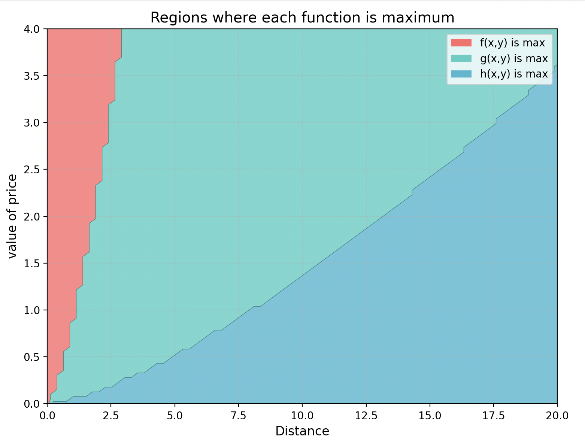

# RL-Transportation
This repository is simple project on use Reinforcement Learning in urban transportation

## Cost function
$cost = value_time * (\frac{distance}{velocity})^{1.8} + distance^{0.5} * price * value_price $ 

  

I choosed Value of price 2 because I seems reasenable

