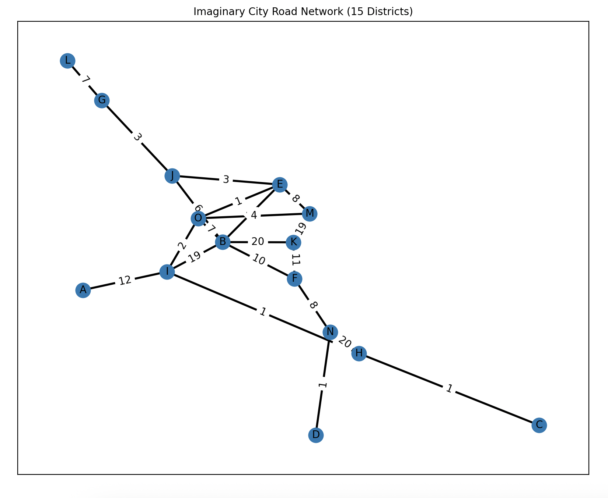

# RL-Transportation

This repository contains a simple project that applies Reinforcement Learning (RL) to urban transportation problems.

---

## Method

As a first method, we attempt to learn Q-values using the Bellman equation:

$$
Q^\pi(s, a) = \mathbb{E}[R_{t+1} + \gamma Q^\pi(s_{t+1}, a_{t+1}) \mid s_t = s, a_t = a]
$$

We are currently focusing on Q-learning with function approximation to handle the large state-action space.

---

## City Structure

The simulated city consists of **15 districts**, connected by roads. The structure of the map is shown below:

  

---

## Cost Function

The cost of each action (i.e., traveling from one district to another using a specific mode of transport) is calculated using the following function:

$$
cost = value_{time} \cdot \left(\frac{distance}{velocity}\right)^{1.8} + distance^{0.5} \cdot price \cdot value_{price}
$$

  

We use a `value_price` of **2**, which seems reasonable based on the current setup.

---

## Vector Representations

- **State Vector:** For a city with `N` districts, the state is represented by an `N`-dimensional one-hot vector indicating the current district.
  
- **Action Vector:** The action is represented using two parts:
  - A one-hot vector of length `N` indicating the destination district.
  - A one-hot vector of length `3` indicating the mode of transport:
    - Walk
    - Bicycle
    - Taxi

Total action vector size: `N + 3`

---

## Results

**Work in progress...**

Initial experiments using a Multi-Layer Perceptron (MLP) to jointly learn both navigation and transport mode selection were not fully successful. However, **the model performs well for navigation alone.** This suggests that separating the tasks could lead to better performance. **The current plan is to train a separate model focused specifically on choosing the appropriate mode of transportation.**

The current focus is on improving **transport mode selection**.

---

## TODO

- [x] Implement linear Q-learning
- [x] Transition to MLP-based function approximation
- [ ] Improve exploration strategy (e.g., softmax instead of ε-greedy)
- [ ] Train models for separate sub-tasks
- [ ] Visualize learned policy

---

Feel free to explore the code and contribute with suggestions or improvements!